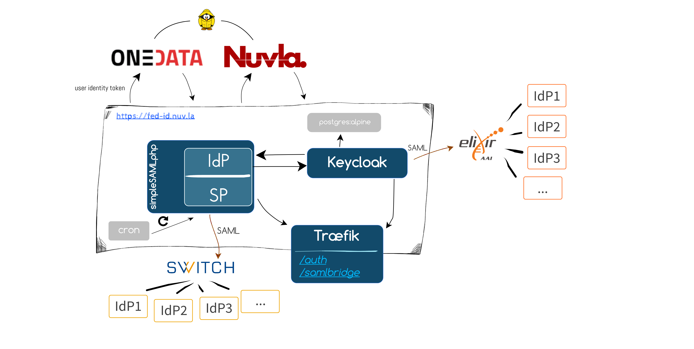

**repository content based on https://github.com/cyclone-project/cyclone-federation-provider**

# fed-id

A federated identity portal for authenticating users within SixSq's brokerage service, Nuvla. This feature comes as a requirement and added-value for multiple European funded projects.

# Architecture

# User Guide

When authenticating with Nuvla, users will be redirected to https://fed-id.nuv.la/auth/admin/master/console/

Users can either login with a local account, social providers or any other identity providers belonging to external federations. When authenticating with an identity federation, users will be prompted with a list of IdPs (like the following figure for eduGAIN)

Users should choose a provider for which they have valid credentials, login and finally they'll be redirected back to Nuvla.
